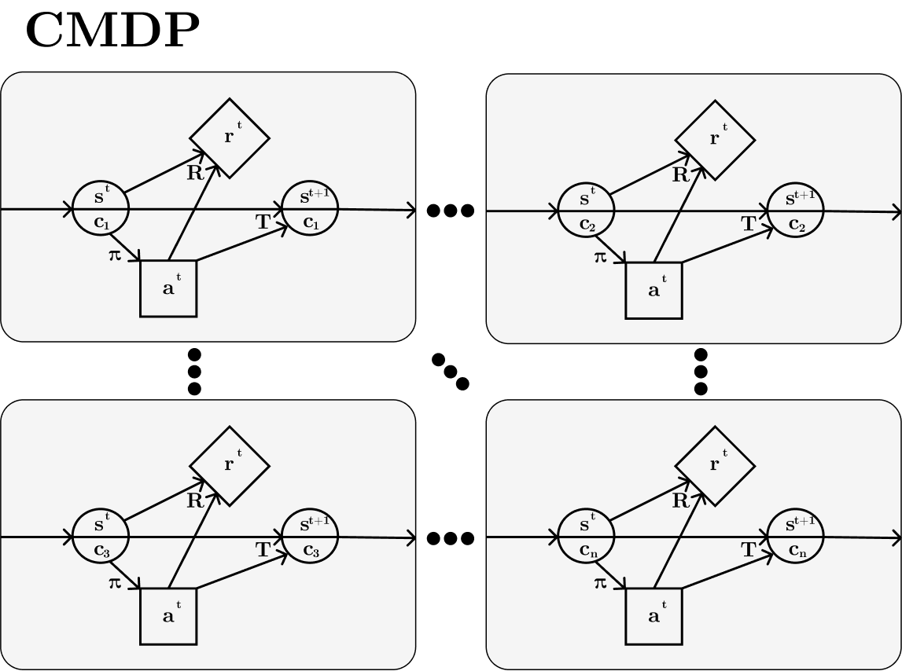
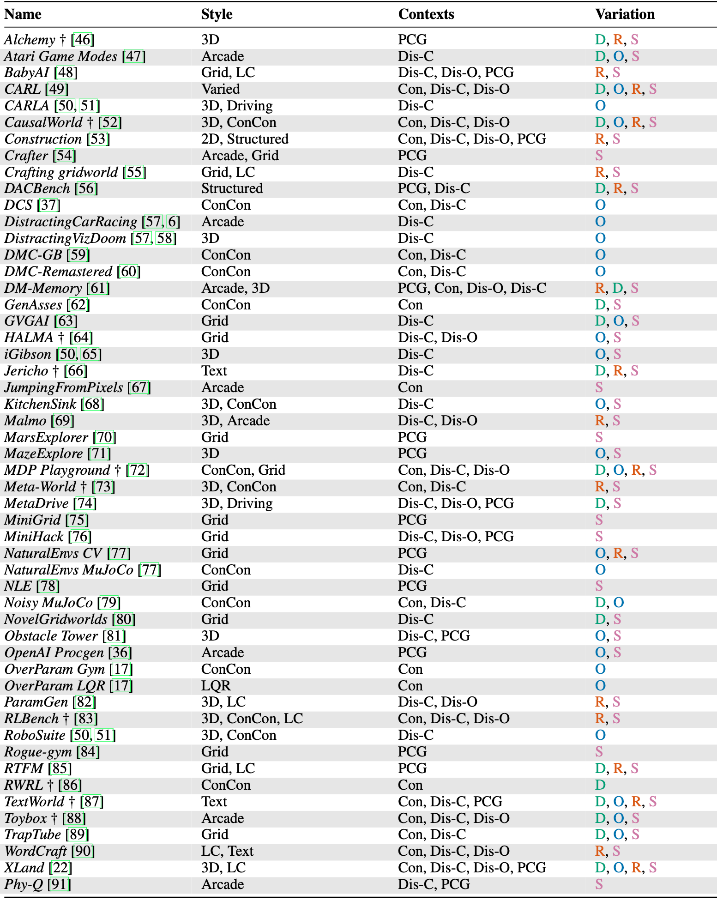
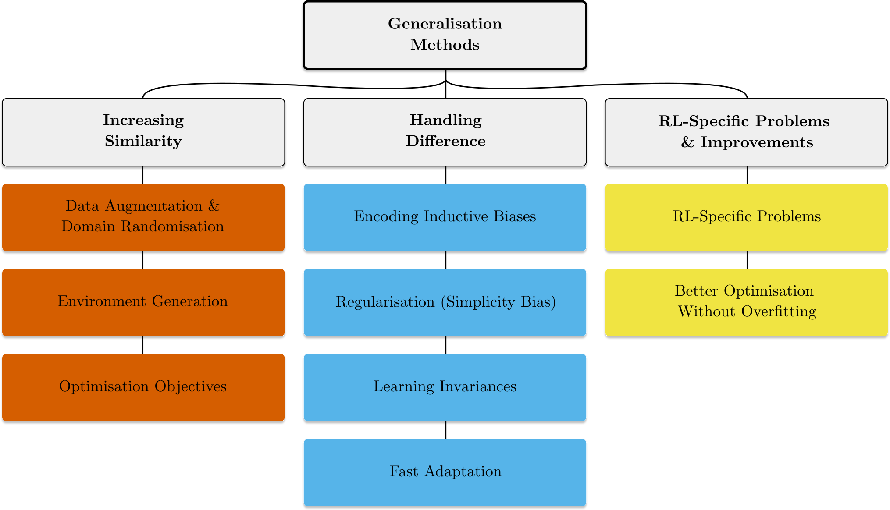

# Generalisation in Reinforcement Learning

Reinforcement Learning (RL) could be used in a range of applications such as autonomous vehicles and robotics, but to fulfil this potential we need RL algorithms that can be used in the real world. Reality is varied, non-stationarity and open-ended, and to handle this algorithms need to be robust to variation in their environments, and be able to transfer and adapt to unseen (but similar) environments during their deployment. Generalisation in RL is all about creating methods that can tackle these difficulties, challenging a common assumption in previous RL research that the training and testing environments are identical.

However, reading RL generalisation research can be challenging, as there is confusion about the exact problem being tackled and the use of terminology. This is because generalisation refers to a *class* of problems within RL, rather than a specific problem. Claiming to improve "generalisation" without being more specific about the type of generalisation that is being improved is underspecified. In fact, it seems unlikely we could improve all types of generalisation with a single method, as an analogy of the [No Free Lunch theorem]([https://ieeexplore.ieee.org/document/585893](https://ieeexplore.ieee.org/document/585893)) may apply.

To address this confusion, we've written a [survey and critical review of the field of generalisation in RL]([https://arxiv.org/abs/2111.09794](https://arxiv.org/abs/2111.09794)). We formally describe the class of generalisation problems and use this formalism to discuss benchmarks for generalisation as well as methods. Given the field is so young, there's also a lot of future directions to explore, and we highlight ones we think are important.

![Figure 1: A visualisation of three types of environment (columns) with respect to their graphical model, training and testing distribution and example benchmarks (rows). Classical RL has focused on environments where training and testing are identical (singleton environments, first column) but in the real world training and testing environments will be different, either from the same distribution (IID Generalisation Environments, second column) or from different distributions (OOD Generalisation Environments, third column).](Blog Post Generalisation in Reinforcement Learning 7012f1b00bbe434bb6de126e22b6bfd3/Group_61.png)

Figure 1: A visualisation of three types of environment (columns) with respect to their graphical model, training and testing distribution and example benchmarks (rows). Classical RL has focused on environments where training and testing are identical (singleton environments, first column) but in the real world training and testing environments will be different, either from the same distribution (IID Generalisation Environments, second column) or from different distributions (OOD Generalisation Environments, third column).

### Formalising Generalisation

So what exactly do we mean when we say generalisation in RL? All research in this area works in a setting where we have a collection of tasks, levels or environments, and generalisation is measured by training and testing on different subsets of this collection.  In the paper, we describe a formal object, the Contextual Markov Decision Process (CMDP), which can capture all of these different settings. This formalism builds on and combines previous works formalising generalisation. Each task, level or environment is determined by a *context*, which for example could be a random seed for a procedural content generation process (as in [OpenAI Procgen](https://openai.com/blog/procgen-benchmark/)), a task id (as in [Meta-World](https://meta-world.github.io/)) or a parameter vector for a controllable simulation and rendering process (as in [Distracting Control Suite](https://arxiv.org/abs/2101.02722)).

To test for generalisation, we then split the set of contexts into training and testing sets. The policy trains on the training set, and is then evaluated on the testing set, which generally contains unseen contexts, and hence unseen levels, tasks or environments. A generalisation problem is hence specified by a CMDP and a choice of training and testing context sets. As generalisation can be a vague term, we call this problem *zero-shot policy transfer*, again building on terminology from previous works.

Figure2: Visualising a CMDP. The state is split into an underlying state s' and a context c, and this context stays the same within episodes but varies between them. Often the policy only observes the underlying state and not the context.

The set of assumptions we make here is very general. This makes it impossible to guarantee generalisation performance given only these assumptions, and also makes it unlikely that a method can improve generalisation across the whole space of problems. This reinforces the point that generalisation is a class of problems, and researchers in this field should make clear the additional assumptions they're making when developing methods and benchmarks. We describe a collection of possible additional assumptions that can be made in the paper.

### Benchmarking Generalisation

Now we have a formal way of specifying a generalisation problem, we can talk about the range of benchmarks for generalisation. Thinking hard about the benchmarks in the field is important, as they define what progress looks like and which problems get solved, especially in RL where we normally can't test our algorithms on real-world problems. We describe benchmarks as a combination of an environment (a CMDP) and an evaluation protocol (a choice of training and testing context sets).

There are a lot of different environments which enable testing generalisation in RL, and we categorise them all in the paper according to **style**, **context set**, and **variation**. See Table 1 in the paper for more details.

The key attribute of interest in environments is the structure of the context set. Environments with a purely black-box procedural content generation (PCG) approach to creating new levels (such as [OpenAI Procgen]([https://openai.com/blog/procgen-benchmark/](https://openai.com/blog/procgen-benchmark/)) or [NLE](https://ai.facebook.com/blog/nethack-learning-environment-to-advance-deep-reinforcement-learning/)) have just the set of all seeds as the context set. This set has no additional structure which we can use, which limits the range of possible evaluation protocols. In fact, the only choice between protocols is the size of the training set (see Figure 3). 

Figure 3: Visualisation of Evaluation Protocols for PCG Environments. **A** uses a single training context, and the entire set for testing. **B** uses a small collection of random training contexts, and the entire set for testing. **C** reverses this, using the entire set for training apart from random held out contexts that are used for testing.

In contrast to purely PCG approaches, many environments have a structured, *controllable* context set (such as Distracting Control Suite or Meta-World). These context sets are generally a product of multiple factors of variation such as gravity or friction coefficients, visual distractions or object colour and quantity. In this setting, we have a lot more options when it comes to choosing an evaluation protocol, which enables us to test for a variety of different kinds of generalisation, from fully interpolating within the context set, through combinatorially interpolating to unseen combinations of seen factors, to extrapolating out of distribution on single or multiple factors (see Figure 4). 

![Figure 4: Visualisation of Evaluation Protocols for Controllable Environments. Each diagram visualises one training set and multiple testing sets. **A** chooses the range for each factor independently in training, resulting in a convex shape. Testing distributions ca be interpolation (red), extrapolation along a single factor (either green square) or extrapolation along both factors (blue). In **B** and **C**, the ranges for each factor are linked, resulting in a non-convex shape for the training distribution. This enables testing combinatorial interpolation (yellow), where factors take values seen during training independently but not in combination. The difference from **B** to **C** is width of the training distribution on the axes we expect the agent to generalise along. In **C** the policy can't learn that the two factors can vary independently, making generalisation harder. In realistic settings settings this space will normally be higher than two dimensions and contain non-continuous and non-ordinal axes.](Blog Post Generalisation in Reinforcement Learning 7012f1b00bbe434bb6de126e22b6bfd3/evaluation_protocols_control.png)

Figure 4: Visualisation of Evaluation Protocols for Controllable Environments. Each diagram visualises one training set and multiple testing sets. **A** chooses the range for each factor independently in training, resulting in a convex shape. Testing distributions ca be interpolation (red), extrapolation along a single factor (either green square) or extrapolation along both factors (blue). In **B** and **C**, the ranges for each factor are linked, resulting in a non-convex shape for the training distribution. This enables testing combinatorial interpolation (yellow), where factors take values seen during training independently but not in combination. The difference from **B** to **C** is width of the training distribution on the axes we expect the agent to generalise along. In **C** the policy can't learn that the two factors can vary independently, making generalisation harder. In realistic settings settings this space will normally be higher than two dimensions and contain non-continuous and non-ordinal axes.

One of the key takeaways from the survey is that purely PCG environments aren't useful for making progress in generalisation research, as they only test a "general" kind of generalisation without disentangling why methods succeed and fail. We recommend a combination of controllable and PCG context sets: using controllable factors of variation at a high level to enable precise scientific experimentation to understand how methods perform, and using PCG at a lower level to generate the sufficient diversity required for policies to generalise without hand-crafting each level separately.

### Methods for Generalisation

Of course, as well as thinking about the problems, we want to understand how we can solve them. This leads us to our categorisation of methods for improving generalisation in RL. A generalisation problem occurs when the training and testing context sets are different, and the policy then learns to rely on features of the training environments which may change at test time. Conceptualising generalisation this way leads us to classify generalisation methods into three categories: Those that try and increase the similarity between the training and testing data and objectives, those that explicitly handle the difference in features between training and testing, and those that handle RL-specific generalisation problems or optimisation improvements (see Figure 5).

Figure 5: Categorisation of methods for tackling generalisation in reinforcement learning

You can see the paper for the full breakdown of these categories and the methods within them, but for now we'll highlight a few key areas where we believe exciting future work could be done.

The first is environment generation. This research direction aims to produce methods for actively sampling from context sets so to enable efficient training in this space and generalisation across the full range of levels in the context set. Environment generation methods aiming to maximize the regret of the student agent hold promise in generating curricula that cover the full space of challenges in the context space. When this context space is unbounded, such methods can lead to an [open-ended learning process]([https://arxiv.org/abs/1905.10985](https://arxiv.org/abs/1905.10985)). Early examples include [POET]([https://arxiv.org/abs/1901.01753](https://arxiv.org/abs/1901.01753)) and [PAIRED]([https://arxiv.org/abs/2012.02096](https://arxiv.org/abs/2012.02096)), and there is exciting work happening in our lab improving on these methods by [understanding how PAIRED and curriculum methods like PLR can be understood as two sides of the same coin]([https://arxiv.org/abs/2110.02439](https://arxiv.org/abs/2110.02439)), as well as improvements to the generation process, such as adding an [editing capability to the environment generator]([https://neurips.cc/Conferences/2021/ScheduleMultitrack?event=35781](https://neurips.cc/Conferences/2021/ScheduleMultitrack?event=35781)) and [preventing potentially harmful selective-sampling bias due to the curriculum]([https://neurips.cc/Conferences/2021/ScheduleMultitrack?event=35741](https://neurips.cc/Conferences/2021/ScheduleMultitrack?event=35741)).

The next area we want to highlight is fast online adaptation. While there's lots of work on Meta-RL, much of it assumes access to multiple training episodes before evaluation, which isn't the setting we're interested in. However, several methods do adapt online within a single episode, using either a [hard-coded]([https://nicklashansen.github.io/PAD/](https://nicklashansen.github.io/PAD/)) or [learned]([https://arxiv.org/abs/1910.08348](https://arxiv.org/abs/1910.08348)) update rule. This work will be especially useful in more challenging settings where adaptation will be necessary to get good performance (for example in reward-function or dynamics variation settings).

Finally, there's very little work tackling RL-specific issues for generalisation. [Recent work]([https://arxiv.org/abs/2006.05826](https://arxiv.org/abs/2006.05826)) showed that the non-stationarity of the data distribution for RL negatively affects generalisation performance, but more investigation into problems of generalisation which arise in the RL setting specifically will be beneficial. For example, the use of bootstrapping and TD learning, the exploration-exploitation tradeoff and the high variance of data collection and learning could all interact with generalisation performance in ways we don't yet understand.

A table capturing all the methods we discuss in the paper. Looking at the primary adjustment made by each method, green normal-text methods adjust the training environment, red monospace-text methods adjust the architecture, and blue italic-text methods adjust the loss function.

### What's Next for Generalisation?

So that's where the field is at right now. But what next? There are many different research paths to be explored, and we highlight a few crucial avenues here.

Firstly, offline RL seems particularly useful in applying RL to the real world, but almost all work in this area tackles tasks where the offline data is collected from the same environment that's used for evaluation. Jointly tackling generalisation and offline RL will be important in applying these methods to a diverse set of real-world scenarios.

Thinking further about realistic problem settings and deployment scenarios, continual RL is another extension of the generalisation problem which is particularly relevant. Policies will be deployed in a setting where they continue to see more data and where the tasks and environments change, and developing methods that can thrive in this setting is needed.

Finally, more research on handling generalisation to novel rewards or goals is necessary to have systems that can do a variety of tasks in a variety of environments, rather than just a single task in a variety of environments. This will involve understanding the best way to specify goals to an agent, trading off between approaches that make RL optimisation easier and those that are usable for humans to specify goals.

---

This was just a quick peek of everything we cover in the survey, but there's lots more useful information in the paper such as a discussion of compositional generalisation, context-efficient learning, inductive biases, and further structural assumptions for improved generalisation. [Check it out]([https://arxiv.org/abs/2111.09794](https://arxiv.org/abs/2111.09794)) for all the gory details of generalisation in RL!

*Thanks to Amy Zhang, Minqi Jiang and Tim Rocktäschel for comments on drafts of this post. This post is based on [A Survey Of Generalisation In Deep Reinforcement Learning](*[https://arxiv.org/abs/2111.09794](https://arxiv.org/abs/2111.09794)), which *was joint work with Amy Zhang, Edward Grefenstette, and Tim Rocktäschel.*